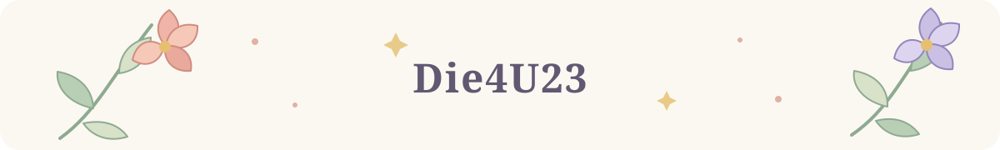

# 你好，我是 Die4U23 👋

[English](README.md) | **简体中文**

我对高性能、高并发系统开发感兴趣。

  

## 精选项目

- **[Raft-KV](https://github.com/Die4U23/Raft-KV)** — 分布式键值存储项目，关注共识、一致性与可靠性工程。
- **[EvoRec](https://github.com/Die4U23/EvoRec)** — 推荐系统研究项目，重视实验过程记录与结果复现。
- **[ArcBench Agent](https://github.com/Die4U23/arcbench-agent)** — 课程项目，探索从需求分析到构建、测试和修复的编码 Agent 工作流。

我也会在[博客](https://mengsblog.top)分享算法、C++ 与软件工程相关内容。

## 技术栈

  

